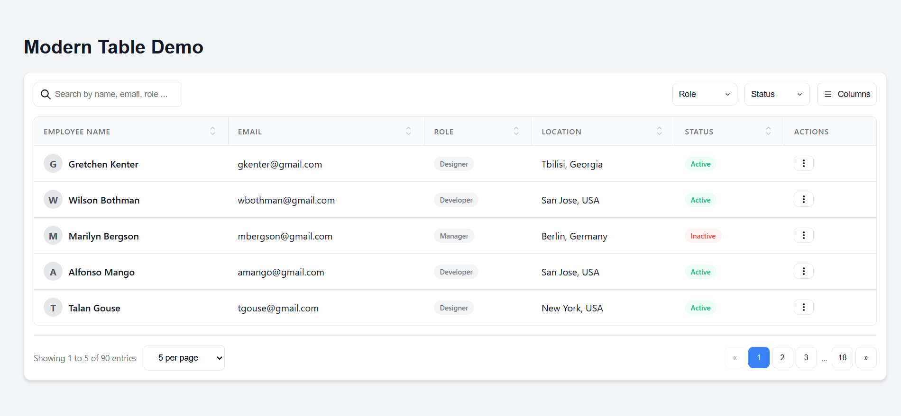

# JS Modern Table

A lightweight, dependency-free, and highly customizable JavaScript table library for building modern data grids with ease.

[**Live Demo**](https://istiauqahmedsiam.github.io/jsModernTable/demo)



## Features

- 🚀 **Zero Dependencies**: Pure vanilla JavaScript, CSS3, and HTML5.
- 🔍 **Global Search**: Search across multiple columns with debounced input.
- 🔢 **Smart Pagination**: Numbered pagination with ellipsis support for large datasets.
- ↕️ **Advanced Sorting**: Modern SVG icons with clear ASC/DESC indicators.
- 🛠️ **Custom Filters**: Easy-to-use filter dropdowns with chips for active filters.
- 🙈 **Column Visibility**: Toggle columns on the fly.
- 🎨 **Responsive Design**: Modern aesthetic including hover effects and smooth transitions.
- 🔄 **Dynamic Data**: Update table content dynamically via the `setData()` method.

## Installation

Simply include the CSS and JS files in your project:

```html
<link rel="stylesheet" href="src/modern-table.css">
<script src="src/modern-table.js"></script>
```

## Basic Usage

Create a container element in your HTML:

```html
<div id="my-table"></div>
```

Initialize the table with your data and column definitions:

```javascript
const table = new ModernTable('#my-table', {
    pageSize: 10,
    showSearch: true,
    data: [
        { id: 1, name: 'John Doe', role: 'Admin' },
        { id: 2, name: 'Jane Smith', role: 'User' },
        // ... more data
    ],
    columns: [
        { field: 'id', title: 'ID', sortable: true, searchable: false },
        { field: 'name', title: 'Full Name', sortable: true },
        { field: 'role', title: 'Role' }
    ]
});
```

## Configuration Options

| Option | Type | Default | Description |
| :--- | :--- | :--- | :--- |
| `data` | Array | `[]` | Array of objects to display in the table. |
| `columns` | Array | `[]` | Configuration for table columns (see below). |
| `pageSize` | Number | `10` | Number of rows to show per page. |
| `pageSizeOptions` | Array | `[5, 10, 20, 50]` | Options for the "per page" selector. |
| `showSearch` | Boolean | `true` | Show/hide the global search input. |
| `searchPlaceholder`| String | `'Search...'` | Placeholder text for the search box. |
| `showColumns` | Boolean | `true` | Show/hide the column visibility toggle. |
| `pagination` | Boolean | `true` | Enable/disable pagination. |
| `filters` | Array | `[]` | Custom filter definitions. |

## Column Definitions

Each column object supports the following properties:

| Property | Type | Description |
| :--- | :--- | :--- |
| `field` | String | The key in your data object. |
| `title` | String | The display title for the table header. |
| `sortable` | Boolean | Set to `false` to disable sorting for this column. |
| `searchable` | Boolean | Set to `false` to exclude this column from global search. |
| `render` | Function | Custom HTML renderer: `(value, row) => '<b>' + value + '</b>'` |

## API Methods

### `setData(newData)`
Updates the table data dynamically (useful for AJAX updates).
```javascript
table.setData(updatedDataArray);
```

### `setPage(pageNumber)`
Navigates to a specific page.
```javascript
table.setPage(2);
```

## Advanced Filtering

Add multi-select filters to your table:

```javascript
const table = new ModernTable('#user-table', {
    // ...
    filters: [
        {
            field: 'role',
            title: 'Role',
            options: ['Admin', 'Editor', 'User']
        }
    ]
});
```

## License

This project is licensed under the MIT License.
